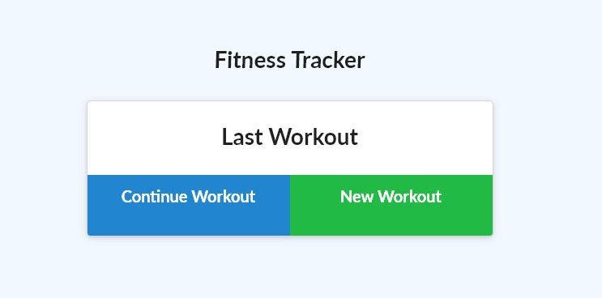

# Fitness-Tracker

## Description:
This project is a node server based Heroku app using MongoDB! Track your workouts and view your stats over time. 
   
## Table of Contents:
* [Installation](#installation)
* [Usage](#usage)
* [Questions](#questions)

## Installation
Run NPM Install in your terminal if you wish to use this application locally. 

## Usage
On the Main Page (screenshot above), you can either Continue a Workout or do a New Workout. When you visit the Dashboard (link on the top left of viewport), you can cross out exercises that you've added and update the stats. 

## Questions
Visit my Github page [jacobhoss](https://github.com/jacobhoss)
For any questions, please contact me at jacobhenryhoss2@gmail.com 

## Visit the URL on Heroku to try it out!

[Heroku App](https://gentle-scrubland-37505.herokuapp.com/)